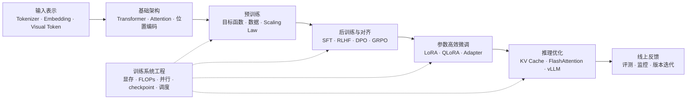

# LLM 学习地图

> [!note]
> 本页是 `01-主题地图` 的总入口。它只负责路由：先给出主主题域，再把具体概念交给各主题页承接。

## 1. 先看哪一页

| 需求                                           | 入口                                                                  |
| -------------------------------------------- | ------------------------------------------------------------------- |
| 先建立全局感                                       | [0a](0a.LLM%E5%85%A8%E6%B5%81%E7%A8%8B%E6%80%BB%E8%A7%88.md)        |
| 查模型结构、输入表示、Attention、位置编码、多模态输入              | [基础架构](%E5%9F%BA%E7%A1%80%E6%9E%B6%E6%9E%84.md)                     |
| 查预训练目标、数据、Scaling Law、优化闭环                   | [预训练](%E9%A2%84%E8%AE%AD%E7%BB%83.md)                               |
| 查 LoRA、QLoRA、Adapter、低成本适配                   | [参数高效微调](%E5%8F%82%E6%95%B0%E9%AB%98%E6%95%88%E5%BE%AE%E8%B0%83.md) |
| 查 SFT、RLHF、PPO、DPO、GRPO、Rollout、Reasoning RL | [后训练与对齐](%E5%90%8E%E8%AE%AD%E7%BB%83%E4%B8%8E%E5%AF%B9%E9%BD%90.md) |
| 查 KV Cache、FlashAttention、MLA、vLLM、推理服务      | [推理优化](%E6%8E%A8%E7%90%86%E4%BC%98%E5%8C%96.md)                     |
| 查显存、FLOPs、吞吐、并行、veRL、Ray、FSDP                | [训练系统工程](%E8%AE%AD%E7%BB%83%E7%B3%BB%E7%BB%9F%E5%B7%A5%E7%A8%8B.md) |

---

| 模块     | 关注点                                                                | 当前入口                                                                                                                                                            |
| ------ | ------------------------------------------------------------------ | --------------------------------------------------------------------------------------------------------------------------------------------------------------- |
| 资源预算   | 参数量、FLOPs、训练/推理显存、KV cache 估算                                      | [[2.3 - 大模型资源分析]]                                                                                                                                               |
| 并行与切分  | DP / TP / PP / ZeRO / FSDP / Expert Parallelism                    | [[2.3 - LLM并行策略]]                                                                                                                                               |
| 后训练框架  | veRL、Single Controller、WorkerGroup、rollout/reward/advantage/update | [Verl 学习笔记](../02-%E6%A6%82%E5%BF%B5%E7%AC%94%E8%AE%B0/Verl/Verl.md)                                                                                            |
| 分布式运行时 | Ray Actor、Object Store、Placement Group、DataProto、TransferQueue     | [Ray in veRL](../02-%E6%A6%82%E5%BF%B5%E7%AC%94%E8%AE%B0/Verl/Ray%20in%20veRL%EF%BC%9A%E4%BB%8E%20Ray%20Core%20%E5%88%B0%20RL%20Worker%20%E7%BC%96%E6%8E%92.md) |
| 推理服务   | vLLM、scheduler、KV block manager、parallel serving                   | [[2.7 - vllm]]                                                                                                                                                  |
| 实验运行机制 | checkpoint、日志、实验追踪、恢复、版本比较                                         | 待补                                                                                                                                                              |
| 性能与稳定性 | MFU、吞吐、通信计算重叠、OOM 排查、可观测性                                          | 待补                                                                                                                                                              |
|        |                                                                    |                                                                                                                                                                 |

## 1. 一条主线

LLM 可以先看成一条从输入到上线的链路：

```text
文本 / 图像 / 工具请求
  -> 输入表示与模型结构
  -> 预训练形成基座能力
  -> 后训练与对齐塑造行为
  -> 参数高效微调适配场景
  -> 推理优化支撑服务
  -> 线上反馈推动迭代

训练系统工程横切所有阶段。
```

## 2. 全流程图


